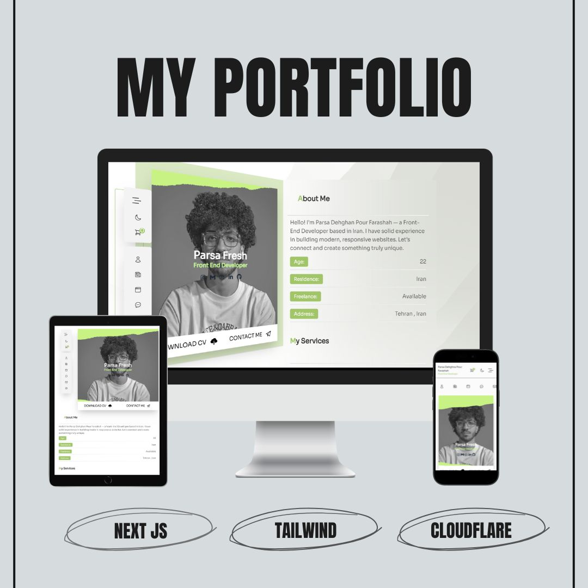

# ​​ 3D Portfolio Website | وب‌سایت پورتفولیو سه‌بعدی

A modern and fully responsive **portfolio website** built with **Next.js**, featuring **3D interactive elements** in desktop view. Hosted on **Cloudflare Pages**—my first deployment with the platform—this site engages visitors with smooth animations, immersive design, and professional presentation.

این پروژه یک وب‌سایت پورتفولیو مدرن و کاملاً ریسپانسیو است که با **Next.js** توسعه یافته و در نسخه دسکتاپ دارای المان‌های **سه‌بعدی** تعاملی است. این سایت اولین تجربه من در میزبانی روی **Cloudflare Pages** است و با انیمیشن‌های نرم و طراحی جذاب، نمونه‌کارها و مهارت‌ها را به‌صورت حرفه‌ای نمایش می‌دهد.

---

##  Project Details | جزئیات پروژه  
**Project Date:** August 8, 2025 | ۸ آگوست ۲۰۲۵  
**Live Demo:** [Visit Live Portfolio](https://787299b2.testnavportfolio.pages.dev/)

---

## ​ Key Features | ویژگی‌های کلیدی

-  **3D Interactive Elements** specifically on desktop  
-  **Fully Responsive Layout** for desktop, tablet, and mobile  
-  **First-time Deployment on Cloudflare Pages**  
-  **High Performance** with server-side rendering via Next.js  
-  **Clean, Modern UI/UX** with smooth animations  
-  **SEO Optimized** structure for better search engine visibility  
-  **Modular Components** for easy scalability and maintenance  

---

##  Tech Stack | تکنولوژی‌های استفاده‌شده

- **Next.js** – Modern React framework with SSR & SSG  
- **React Three Fiber** – 3D rendering in React components  
- **Tailwind CSS** – Utility-first CSS for rapid styling  
- **Framer Motion** – Animations and transitions  
- **JavaScript / ES6+** – Logic and interactivity  
- **Cloudflare Pages** – Production deployment and hosting  

---

## ​​​ Developed By | توسعه‌دهنده  
**Parsa Dehghan Pour Farashah**  

##  Project Mentor | مربی پروژه  
[@parsa_ghorbanian_web](https://www.instagram.com/parsa_ghorbanian_web)

---

##  Connect with Me | ارتباط با من

-  **Instagram:** [@parsa_dehghanpour_dv](https://www.instagram.com/parsa_dehghanpour_dv?igsh=eHkwNWhsa3I4ZWVp)  
-  **LinkedIn:** [parsa-dehghan-pour-farashah](https://linkedin.com/in/parsa-dehghan-pour-farashah-85ab04250)  
-  **GitHub:** [parsa-farshah](https://github.com/parsa-farshah)  
-  **Email:** parsafarashah2002@gmail.com  
-  **YouTube:** [@FrontEndFresh](https://youtube.com/@frontendfresh?si=-2WsIYe-KBTUfwyu)

---

##  Screenshots | پیش‌نمایش پروژه

###  Overview  

###  Desktop (3D Interactive View)  

###  Tablet View  

###  Mobile View  

---

> ** Pro Tip:** Try interacting with the 3D elements on desktop—it's designed to respond to your cursor and bring your portfolio to life!
